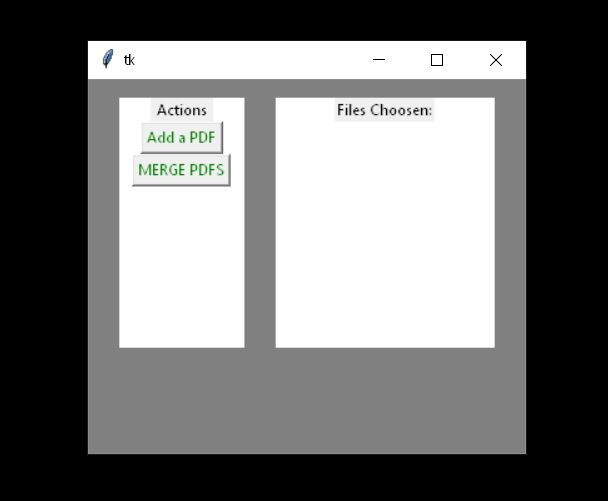
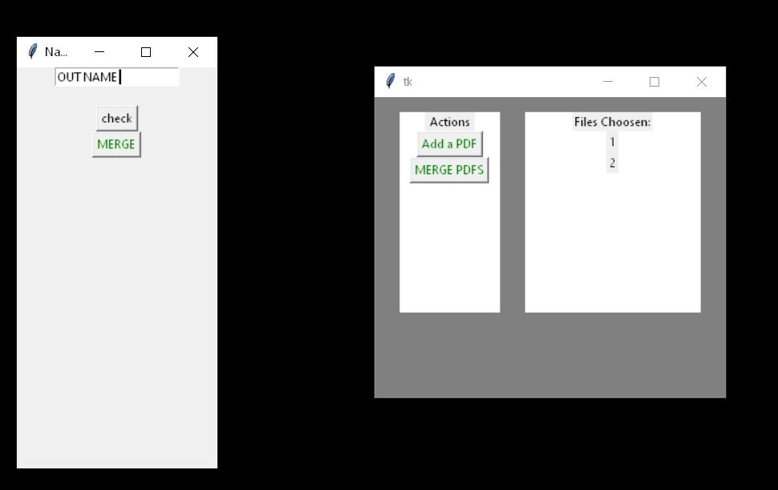

# PDFmerger

### ABOUT 
Program merges two pdfs into one. It uses Tkinter for its GUI and PyPDF2 for PDF handling.   

### PREVIEW
 

 

### Setup

For setup you need Tkinter and Pathlib which should be already standart libliaries in your python.  
You will ned to install PyPDF2 liblray. 

### Sources

You can check sources in sources folder 
